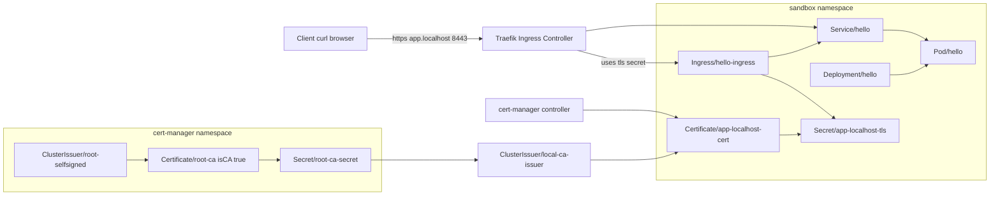
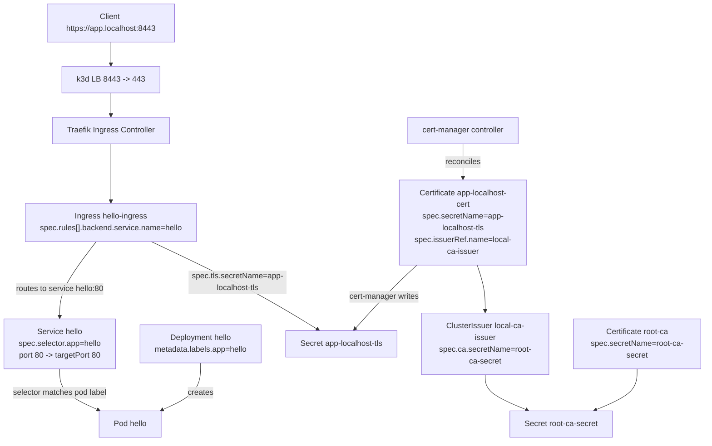

# Lab 03 - Private CA Bootstrap and CA-Signed Ingress TLS

## Objective

Bootstrap an internal root CA, issue a CA-signed application certificate, terminate TLS at Traefik Ingress, and validate trust with `curl`.

## Why This Stage Matters

This is the first realistic private PKI flow:

- One root of trust
- Reusable CA issuer
- Server cert issuance for workloads
- Trust validation from client side

## Step 1 - Create Root CA via SelfSigned

```bash
cat <<'EOF' | kubectl apply -f -
apiVersion: cert-manager.io/v1
kind: ClusterIssuer
metadata:
  name: root-selfsigned
spec:
  selfSigned: {}
---
apiVersion: cert-manager.io/v1
kind: Certificate
metadata:
  name: root-ca
  namespace: cert-manager
spec:
  isCA: true
  commonName: k3d-local-root-ca
  secretName: root-ca-secret
  privateKey:
    algorithm: RSA
    size: 4096
  issuerRef:
    name: root-selfsigned
    kind: ClusterIssuer
EOF
```

Verify:

```bash
kubectl get certificate -n cert-manager root-ca
kubectl get secret -n cert-manager root-ca-secret
```

## Step 2 - Create CA ClusterIssuer from Root Secret

```bash
cat <<'EOF' | kubectl apply -f -
apiVersion: cert-manager.io/v1
kind: ClusterIssuer
metadata:
  name: local-ca-issuer
spec:
  ca:
    secretName: root-ca-secret
EOF

kubectl describe clusterissuer local-ca-issuer
```

## Step 3 - Deploy Sample App + Service

```bash
cat <<'EOF' | kubectl apply -f -
apiVersion: apps/v1
kind: Deployment
metadata:
  name: hello
  namespace: sandbox
spec:
  replicas: 1
  selector:
    matchLabels:
      app: hello
  template:
    metadata:
      labels:
        app: hello
    spec:
      containers:
        - name: hello
          image: nginx:1.27-alpine
          ports:
            - containerPort: 80
---
apiVersion: v1
kind: Service
metadata:
  name: hello
  namespace: sandbox
spec:
  selector:
    app: hello
  ports:
    - port: 80
      targetPort: 80
EOF
```

## Step 4 - Issue App Certificate (CA Signed)

```bash
cat <<'EOF' | kubectl apply -f -
apiVersion: cert-manager.io/v1
kind: Certificate
metadata:
  name: app-localhost-cert
  namespace: sandbox
spec:
  secretName: app-localhost-tls
  dnsNames:
    - app.localhost
  issuerRef:
    name: local-ca-issuer
    kind: ClusterIssuer
  usages:
    - digital signature
    - key encipherment
    - server auth
EOF
```

Wait and verify:

```bash
kubectl wait --for=condition=Ready certificate/app-localhost-cert -n sandbox --timeout=180s
kubectl get secret -n sandbox app-localhost-tls
```

## Step 5 - Configure Ingress TLS

First ensure host mapping:

```bash
echo "127.0.0.1 app.localhost" | sudo tee -a /etc/hosts
```

Create Ingress:

```bash
cat <<'EOF' | kubectl apply -f -
apiVersion: networking.k8s.io/v1
kind: Ingress
metadata:
  name: hello-ingress
  namespace: sandbox
spec:
  ingressClassName: traefik
  tls:
    - hosts:
        - app.localhost
      secretName: app-localhost-tls
  rules:
    - host: app.localhost
      http:
        paths:
          - path: /
            pathType: Prefix
            backend:
              service:
                name: hello
                port:
                  number: 80
EOF
```

## Step 6 - Validate End-to-End HTTPS

Without trust (expect warning unless `-k`):

```bash
curl -vk https://app.localhost:8443/
```

Export root CA and validate trust chain explicitly:

```bash
kubectl get secret -n cert-manager root-ca-secret -o jsonpath='{.data.tls\.crt}' | base64 -d > /tmp/root-ca.crt
curl --cacert /tmp/root-ca.crt https://app.localhost:8443/
```

Certificate sanity:

```bash
kubectl get secret -n sandbox app-localhost-tls -o jsonpath='{.data.tls\.crt}' | base64 -d > /tmp/app-localhost.crt
openssl verify -CAfile /tmp/root-ca.crt /tmp/app-localhost.crt
openssl x509 -in /tmp/app-localhost.crt -noout -issuer -subject -dates
```

## Resource Interaction Diagram (including Step 1 Root CA)



## YAML Wiring Diagram (Field-Level, Easy to Read)

This diagram shows exactly which YAML field connects to which resource.



Quick YAML reading checklist:

1. `Deployment.metadata.labels` must match `Service.spec.selector`.
2. `Ingress.spec.rules[].backend.service.name` must equal `Service.metadata.name`.
3. `Ingress.spec.tls[].secretName` must equal `Certificate.spec.secretName`.
4. `Certificate.spec.issuerRef.name` must point to an existing `Issuer` or `ClusterIssuer`.
5. For CA issuer flow, `ClusterIssuer.spec.ca.secretName` must point to the root CA secret.

## Failure Injection

Break host match intentionally:

1. Change Ingress host to `wrong.localhost`
2. Keep cert SAN as `app.localhost`
3. Call `https://wrong.localhost:8443`

Expected: hostname verification failure.

## Cleanup

```bash
kubectl delete ingress -n sandbox hello-ingress
kubectl delete certificate -n sandbox app-localhost-cert
kubectl delete secret -n sandbox app-localhost-tls --ignore-not-found
kubectl delete deploy,svc -n sandbox hello
kubectl delete clusterissuer local-ca-issuer root-selfsigned
kubectl delete certificate -n cert-manager root-ca
kubectl delete secret -n cert-manager root-ca-secret --ignore-not-found
```

## Exit Criteria

You are ready for Lab 04 when:

- `curl --cacert /tmp/root-ca.crt https://app.localhost:8443` succeeds
- You can explain trust chain and SAN matching behavior
