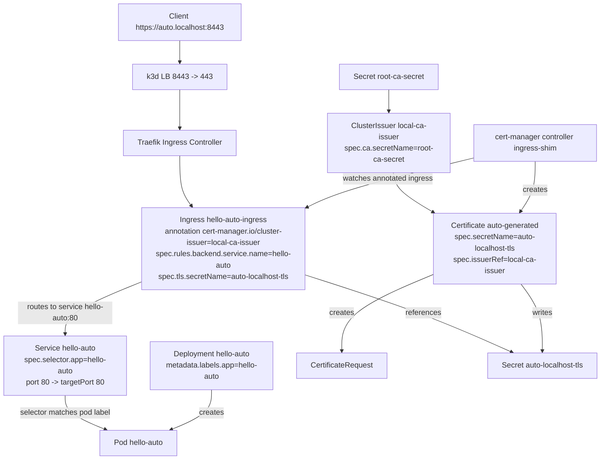

# Lab 04 - Ingress Annotation Automation (Ingress Shim)

## Objective

Automate certificate provisioning from annotated Ingress resources and understand generated ownership graph.

## Why This Stage Matters

In real teams, app owners often manage only Ingress manifests. cert-manager Ingress integration allows secure defaults without requiring each team to handcraft `Certificate` objects.

### Explanation

This lab teaches the following flow:

1. You only write the Ingress YAML.
2. With the `cert-manager.io/cluster-issuer` annotation on Ingress, cert-manager automatically creates a `Certificate`, a `CertificateRequest`, and a TLS `Secret`.
3. The Ingress then uses that TLS Secret to serve HTTPS traffic.

The phrase "generated ownership graph" means the dependency chain between resources:

- Ingress -> (triggers) auto-generated Certificate -> CertificateRequest -> TLS Secret

Why this model is useful:

- The application team can move fast by managing only Ingress.
- The platform team can centrally manage issuer, CA, and policy controls.
- The TLS process becomes standardized, repeatable, and less error-prone.

## Step 1 - Recreate CA Issuer Quickly

If not already present from Lab 03:

```bash
cat <<'EOF' | kubectl apply -f -
apiVersion: cert-manager.io/v1
kind: ClusterIssuer
metadata:
  name: root-selfsigned
spec:
  selfSigned: {}
---
apiVersion: cert-manager.io/v1
kind: Certificate
metadata:
  name: root-ca
  namespace: cert-manager
spec:
  isCA: true
  commonName: k3d-local-root-ca
  secretName: root-ca-secret
  issuerRef:
    name: root-selfsigned
    kind: ClusterIssuer
---
apiVersion: cert-manager.io/v1
kind: ClusterIssuer
metadata:
  name: local-ca-issuer
spec:
  ca:
    secretName: root-ca-secret
EOF
```

## Step 2 - Deploy Sample Workload

```bash
cat <<'EOF' | kubectl apply -f -
apiVersion: apps/v1
kind: Deployment
metadata:
  name: hello-auto
  namespace: sandbox
spec:
  replicas: 1
  selector:
    matchLabels:
      app: hello-auto
  template:
    metadata:
      labels:
        app: hello-auto
    spec:
      containers:
        - name: hello
          image: nginx:1.27-alpine
          ports:
            - containerPort: 80
---
apiVersion: v1
kind: Service
metadata:
  name: hello-auto
  namespace: sandbox
spec:
  selector:
    app: hello-auto
  ports:
    - port: 80
      targetPort: 80
EOF
```

## Step 3 - Annotated Ingress (No Manual Certificate)

```bash
echo "127.0.0.1 auto.localhost" | sudo tee -a /etc/hosts

cat <<'EOF' | kubectl apply -f -
apiVersion: networking.k8s.io/v1
kind: Ingress
metadata:
  name: hello-auto-ingress
  namespace: sandbox
  annotations:
    cert-manager.io/cluster-issuer: local-ca-issuer
spec:
  ingressClassName: traefik
  tls:
    - hosts:
        - auto.localhost
      secretName: auto-localhost-tls
  rules:
    - host: auto.localhost
      http:
        paths:
          - path: /
            pathType: Prefix
            backend:
              service:
                name: hello-auto
                port:
                  number: 80
EOF
```

## Step 4 - Observe Generated Resources

```bash
kubectl get ingress -n sandbox hello-auto-ingress -o yaml
kubectl get certificate -n sandbox
kubectl get certificaterequest -n sandbox
kubectl describe certificate -n sandbox
```

What to verify:

- A `Certificate` is auto-created by cert-manager
- `secretName` equals Ingress TLS secret name
- Ownership references tie Ingress and Certificate

## Step 5 - Validate HTTPS

```bash
kubectl get secret -n cert-manager root-ca-secret -o jsonpath='{.data.tls\.crt}' | base64 -d > /tmp/root-ca.crt
curl --cacert /tmp/root-ca.crt https://auto.localhost:8443/
```

## Step 6 - Reconciliation Drill

Delete the TLS Secret and observe recovery:

```bash
kubectl delete secret -n sandbox auto-localhost-tls
kubectl get secret -n sandbox -w
```

Expected: cert-manager re-issues and recreates secret.

## Step 7 - Re-Issuance Drill

Change host from `auto.localhost` to `newauto.localhost` and apply.

```bash
echo "127.0.0.1 newauto.localhost" | sudo tee -a /etc/hosts
kubectl edit ingress -n sandbox hello-auto-ingress
```

Then watch:

```bash
kubectl get certificate,certificaterequest -n sandbox -w
```

## YAML Wiring Diagram (Ingress Annotation Automation)

This view focuses on how the YAML fields are connected when you do not create a manual Certificate.



Quick YAML reading checklist:

1. `Deployment.metadata.labels.app` must match `Service.spec.selector.app`.
2. `Ingress.spec.rules.backend.service.name` must equal `Service.metadata.name`.
3. `Ingress.metadata.annotations.cert-manager.io/cluster-issuer` must reference an existing ready issuer.
4. `Ingress.spec.tls.secretName` is the target TLS secret and is reused by the auto-generated `Certificate`.
5. CA flow requires `ClusterIssuer.spec.ca.secretName` to point to a valid root CA secret.
6. Changing Ingress host/SAN inputs should trigger new certificate issuance.

## Troubleshooting

```bash
kubectl describe ingress -n sandbox hello-auto-ingress
kubectl describe certificate -n sandbox
kubectl logs -n cert-manager deploy/cert-manager --tail=200
```

## Cleanup

```bash
kubectl delete ingress -n sandbox hello-auto-ingress
kubectl delete deploy,svc -n sandbox hello-auto
kubectl delete certificate -n sandbox --all
kubectl delete secret -n sandbox auto-localhost-tls --ignore-not-found
```

## Exit Criteria

You are ready for Lab 05 when:

- You can issue TLS from Ingress annotations only
- Secret deletion triggers successful reconciliation
- Hostname changes trigger expected re-issuance behavior
